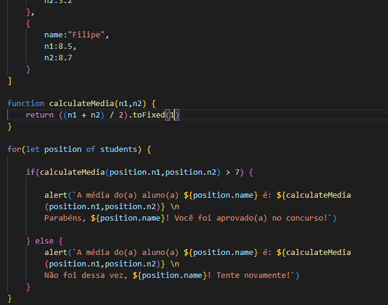

# Algoritmos e Lógica de programação

> Trilha Explorer
Último desafio do stage 4 trilha Explorer da Rocketseat finalizado com sucesso! Agora é continuar praticando os exercícios e partir pro stage 5 (Avançando no JavaScript). \o/

Principais pontos abordados nesse desafio:

- Estrutura de dados com objetos;
- Estrutura de repetição;
- Criação de funções;
- Operadores comparativos;

Nesse desafio você irá criar uma lista de estudantes e, cada estudante dentro dessa lista, deverá conter os seguintes dados:

- nome;
- nota da primeira prova;
- nota da segunda prova.

Depois de criada a lista:

- Crie uma função que irá calcular a média das notas de cada aluno.
- Supondo que a média, para esse concurso é 7, verifique se cada aluno obteve sucesso ou não em entrar no concurso e mostre uma mensagem na tela. 

[🔗 Clique aqui para acessar](https://filipesantos07.github.io/Explorer-Stage-4-ultimo-desafio/)

## 🛠️ Tecnologias

- HTML
- JavaScript

## 💛 Contato

FilipeSantosEstudos1@gmail.com
